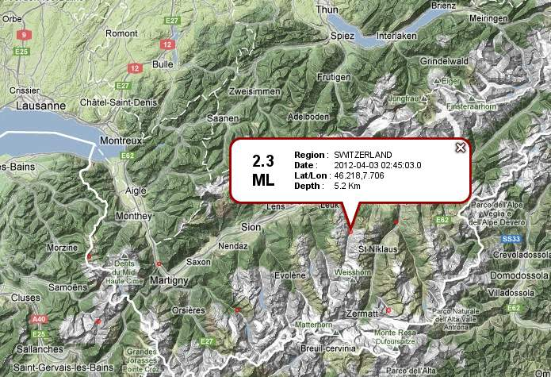
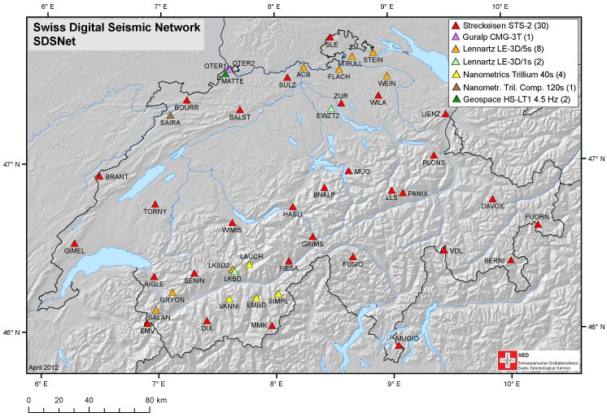

.. _advanced_exercise:

Advanced Exercise
-----------------

.. note::

    Please note that this exercise is several years old and outdated in terms
    of recommended use of obspy, e.g. in terms of higher-level
    functionality like the Inventory object, and that ArcLink has been
    deactivated by data centers and the arclink client removed from obspy.

This practical intends to demonstrate how ObsPy can be used to develop
workflows for data processing and analysis that have a short, easy to read and
extensible source code. The overall task is to automatically estimate local
magnitudes of earthquakes using data of the SED network. We will start with
simple programs with manually specified, hard-coded values and build on them
step by step to make the program more flexible and dynamic.  Some details in
the magnitude estimation should be done a little bit different technically but
we rather want to focus on the general workflow here.

1. Request Earthquake Information from EMSC/NERIES/NERA
~~~~~~~~~~~~~~~~~~~~~~~~~~~~~~~~~~~~~~~~~~~~~~~~~~~~~~~

Fetch a list of events from EMSC for the region of Valais/SW-Switzerland on 3rd
April of 2012. Use the Client provided in :mod:`obspy.clients.fdsn`. Note down the
catalog origin times, epicenters and magnitudes.

2. Estimate Local Magnitude
~~~~~~~~~~~~~~~~~~~~~~~~~~~
a) Use the file `LKBD_WA_CUT.MSEED
   <https://github.com/obspy/examples/blob/master/LKBD_WA_CUT.MSEED?raw=true>`_
   to read MiniSEED waveform data of the larger earthquake. These data have
   already been simulated to (demeaned) displacement on a Wood-Anderson
   seismometer (in meter) and trimmed to the right time span. Compute the
   absolute maximum for both North and East component and use the larger value
   as the zero-to-peak amplitude estimate.  Estimate the local magnitude
   :math:`M_\text{lh}` used at the `Swiss Seismological Service (SED)
   <http://www.seismo.ethz.ch/index_EN>`_ using a epicentral distance of
   :math:`d_\text{epi}=20` (km), :math:`a=0.018` and :math:`b=2.17` with the
   following formula (mathematical functions are available in Python's
   :mod:`python:math` module):

.. math::
    M_\text{lh} = \log_{10}\left(amp \cdot 1000\mathrm{\frac{mm}{m}}\right) +
    a \cdot d_\text{epi} + b

b) Calculate the epicentral distance from the station coordinates (46.387°N,
   7.627°E) and catalog epicenter fetched above (46.218°N, 7.706°E). Some useful
   routines for such tasks are included in :mod:`obspy.geodetics`.

3. Seismometer Correction/Simulation
~~~~~~~~~~~~~~~~~~~~~~~~~~~~~~~~~~~~

a) Modify the existing code and use the file `LKBD.MSEED
   <https://github.com/obspy/examples/blob/master/LKBD.MSEED?raw=true>`_ to
   read the original MiniSEED waveform data in counts. Set up two dictionaries
   containing the response information of both the original instrument (a
   LE3D-5s) and the Wood-Anderson seismometer in poles-and-zeros formulation.
   Please note that for historic reasons the naming of keys differs from the
   usual naming.  Each PAZ dictionary needs to contain *sensitivity* (overall
   sensitivity of seismometer/digitizer combination), *gain* (A0 /
   normalization factor), *poles* and *zeros*. Check that the value of
   *water_level* is not too high, to avoid overamplified low frequency noise at
   short-period stations. After the instrument simulation, trim the waveform to
   a shorter time window around the origin time (*2012-04-03T02:45:03*) and
   calculate :math:`M_\text{lh}` like before.  Use the following values for the
   PAZ dictionaries:

   ===========  ===============  =================
   --           LE3D-5s          Wood-Anderson
   ===========  ===============  =================
   poles        -0.885+0.887j    -6.2832-4.7124j
                -0.885-0.887j    -6.2832+4.7124j
                -0.427+0j
   zeros        0j, 0j, 0j       0j
   gain         1.009            1
   sensitivity  167364000.0      2800
   ===========  ===============  =================

b) Instead of the hard-coded values, read the response information from a locally
   stored *dataless SEED* `LKBD.dataless
   <https://github.com/obspy/examples/blob/master/LKBD.dataless?raw=true>`_.
   Use the Parser of module :mod:`obspy.io.xseed` to extract the poles-and-zeros
   information of the used channel.

c) We can also request the response information from `WebDC
   <http://www.webdc.eu>`_ using the ArcLink protocol. Use the Client provided in
   :mod:`obspy.clients.arclink` module (specify e.g. *user="sed-workshop@obspy.org"*).

4. Fetch Waveform Data from WebDC
~~~~~~~~~~~~~~~~~~~~~~~~~~~~~~~~~

a) Modify the existing code and fetch waveform data around the origin time given
   above for station *LKBD* (network *CH*) via ArcLink from WebDC using
   *obspy.arclink*. Use a wildcarded *channel="EH\*"* to fetch all three
   components. Use keyword argument *metadata=True* to fetch response information
   and station coordinates along with the waveform. The PAZ and coordinate
   information will get attached to the :class:`~obspy.core.trace.Stats` object of
   all traces in the returned Stream object during the waveform request
   automatically. During instrument simulation use keyword argument
   *paz_remove='self'* to use every trace's attached PAZ information fetched from
   `WebDC <http://www.webdc.eu>`_. Calculate :math:`M_\text{lh}` like before.

b) Use a list of station names (e.g. *LKBD*, *SIMPL*, *DIX*) and perform the
   magnitude estimation in a loop for each station. Use a wildcarded
   *channel="[EH]H\*"* to fetch the respective streams for both short-period and
   broadband stations. Compile a list of all station magnitudes and compute the
   network magnitude as its median (available in :mod:`numpy:numpy` module).

c) Extend the network magnitude estimate by using all available stations in
   network *CH*. Get a list of stations using the ArcLink client and loop over
   this list. Use a wildcarded *channel="[EH]H[ZNE]"*, check if there are three
   traces in the returned stream and skip to next station otherwise (some stations
   have inconsistent component codes). Put a *try/except* around the waveform
   request and skip to the next station and avoid interruption of the routine in
   case no data can be retrieved and an Exception gets raised. Also add an
   *if/else* and use :math:`a=0.0038` and :math:`b=3.02` in station magnitude
   calculation for epicentral distances of more than 60 kilometers.

5. Construct Fully Automatic Event Detection, Magnitude Estimation
~~~~~~~~~~~~~~~~~~~~~~~~~~~~~~~~~~~~~~~~~~~~~~~~~~~~~~~~~~~~~~~~~~

In this additional advanced exercise we can enhance the
routine to be independent of a-priori known origin times by using a coincidence
network trigger for event detection.

* fetch a few hours of Z component data for 6 stations in Valais /
  SW-Switzerland
* run a coincidence trigger like shown in the :ref:`Trigger
  Tutorial<trigger-tutorial-coincidence>`
* loop over detected network triggers, store the coordinates of the closest
  station as the epicenter
* loop over triggers, use the trigger time to select the time window and use
  the network magnitude estimation code like before

Solutions
~~~~~~~~~

.. toctree::
   :maxdepth: 1

   advanced_exercise_solution_1
   advanced_exercise_solution_2a
   advanced_exercise_solution_2b
   advanced_exercise_solution_3a
   advanced_exercise_solution_3b
   advanced_exercise_solution_3c
   advanced_exercise_solution_4a
   advanced_exercise_solution_4b
   advanced_exercise_solution_4c
   advanced_exercise_solution_5
